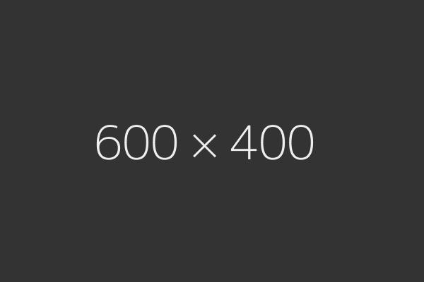

# Mint Works

1 -- 4 Players  
10 -- 20 Minutes  
Ages 13+

<!-- TOC depthFrom:2 depthTo:6 withLinks:1 updateOnSave:1 orderedList:0 -->

- [Contents](#contents)
- [Overview](#overview)
- [Cards](#cards)
	- [Locations](#locations)
		- [Location Types](#location-types)
	- [Plans](#plans)
		- [Plan Types](#plan-types)
- [Icons](#icons)
- [Setup](#setup)
- [Gameplay](#gameplay)
	- [Development](#development)
		- [Place](#place)
		- [Pass](#pass)
	- [Upkeep [Upkeep]](#upkeep-upkeep)
- [Scoring](#scoring)
- [Solitaire Mode](#solitaire-mode)
	- [Setup](#setup)
	- [AI Cards](#ai-cards)
	- [Solitaire specific Rules](#solitaire-specific-rules)

<!-- /TOC -->

## Contents

* Rules
* 1 Start Player Token
* 33 Cards
  * 10 Location Cards
  * 21 Plan Cards
  * 2 AI Cards (double-sided)

## Overview

*Mint Works* is a refreshingly light worker placement game for 1 to 4 players --
easy to learn, with enough depth to keep you coming back.

Players take the role of neighborhood planners and will be working to develop
the finest neighborhood in *Mintopia City*.
To do so they start with \[Mint\]\[Mint\]\[Mint\] and will gain [Mint]
every round.
With these [Mint] they will activate Locations to gain more [Mint], buy Plans
and build those Plans.
Built Plans will grant them abilities, effects and [Star].
When the game ends the player with the most [Star] wins.

## Cards

### Locations

* Name
* Type
* Location Effect
* Mint Placement Space

#### Location Types

* Core
* Deed
* Advanced

### Plans

* Name
* Type
* Cost to Buy
* Star Value
* Effect

#### Plan Types

* Culture
* Production
* Utility
* double-sided

## Icons

[Mint] represents one Mint Token or Mint.
Players will gains them through various Plan and Location Effects and spend
them to develop their Neighborhood.

[Star] represents one Victory Point.
The goal of the game is to gather as much of these as possible.

[Upkeep] represents the Upkeep Phase (see below) in a gameplay round.
Plan Effects marked with this symbol are triggered during this Phase.
## Setup

1. The four Core Locations are placed on the table granting easy access to all
players, showing the side corresponding to the number of players.
2. Next to the Core Locations Core Locations the two Deed Locations are placed,
each with their *closed* side face up.
  * Advanced Setup

    Two of the Advanced Locations are selected at random and also placed next
    to the Core Locations.
3. All Plans are shuffled and stacked face down forming the *Plan Deck*.
4. Three Plans are drawn from and placed face up next to the Plan Deck forming
the *Plan Supply*.
5. The Mint Tokens are placed near the Plan Supply forming the *Mint Supply*.
6. Each player takes \[Mint\]\[Mint\]\[Mint\] from the Mint Supply.
7. The Start Player Token goes to the player with the freshest breath.

  
Play area after Setup

## Gameplay

Each round is divided into two phases:
The Development phase followed by the Upkeep phase.

### Development

The player currently holding he Start Player Token takes the first turn.

A player has two options on their turn. They may choose either
the Place or Pass action.
After completing one of these actions play then continues clockwise
with the next player.

This keeps going until all players consecutively pass, ending the Development
phase.
Afterwards proceed to the Upkeep Phase.

#### Place

The player chooses an unoccupied Mint Placement Space and places the required
amount of [Mint] on it, granting the player the Location's Effect.

#### Pass

The player’sturn is over.On their next turn they will have the chance to choose
*Place* or *Pass* again.

### Upkeep [Upkeep]

1. If any player has seven or more [Star] provided by built Plans in their
Neighborhood, the game ends and Scoring takes place.
2. The Plan Supply is then refilled to three face up Cards from the Plan Deck.
If it was not possible to fill the Plan Supply,
the game ends and Scoring takes place.
3. Resolve all [Upkeep] Effects
4. Return any [Mint] on any Location's Mint Placement Spaces to the Mint Supply.
5. Each player gains [Mint].
6. Proceed to the next Development Phase.

## Scoring

Count the total number of [Star] each player each player earns from built Plans in their Neighborhood.

The player with the most [Star] has the finest Neighborhood and wins!

If two or more players are tied for first place, the tied player with the smallest Neighborhood (i.e. fewest Plans) wins. If there is still a tie, the tied player with the most wins. Still tied? You all win!

## Solitaire Mode

Mint Works can also be played solitaire. The game includes four different AI opponents to play against.

### Setup

* One of the four AIs is selected to represent your opponent.
* The four Core Locations and two Deed Locations are placed in a line on the table, showing the *one player* resp. *closed* sides. Place in the following order: Producer, Wholesaler, Builder,Supplier, Leadership Council, Lotto.
  * Advanced Setup

  One Advanced Location is selected at random and placed after the Lotto.
* All Plans are shuffled are shuffled and stacked face down near the Locations forming the Plan Deck.
* Two Plans are drawn from and placed face up next to the Plan Deck forming the Plan Supply.
* The Mint Tokens are placed set near the Plan Supply forming the Mint Supply.
* \[Mint\]\[Mint\]\[Mint\] are taken from the Mint Supply and added to your Neighborhood.
* \[Mint\] equal to your opponent’s Starting Mint Token Share are taken from the Mint Supply and placed into their Neighborhood.

  
Play area after Solitaire Setup

### AI Cards

* Name
* Title
* Processing Logic
* Starting Mint Token Share
* Cost Preference
* Supplier Buy Priority

### Solitaire specific Rules

The standard rules apply to the solitaire mode of Mint Works. There are however a few exceptions:

* When a Plan is taken from the Plan Supply and not replaced by another effect, replace it immediately with one from the Plan Deck.
* When the AI performs the Place action, it will always place in the first available Mint Placement Space in the Location line, that they can use, starting with the Producer.
* If the AI is unable to use any Location, they choose the Pass action.
* When performing the Place action for your opponent, place the required amount of [Mint] from them on the corresponding Mint Placement Space.
* During [Upkeep], if no [Mint] is on the Supplier before returning all [Mint] to the Mint Supply, put the two Plans in the Plan Supply on the bottom of the Plan Deck, and replace them by two new Plans from the Plan Deck.
* The AI will build the oldest unbuilt Plan in its Neighborhood first.
* The AI will buy Plans based on Cost Preference. If there is a tie for Cost, it buys according to its Supplier Buy Priority. If there is still a tie, it will buy the Plan closest to the Plan Deck.
